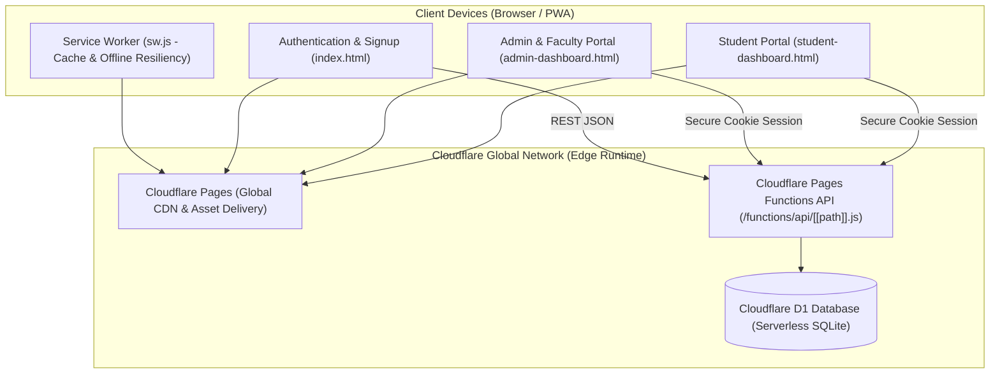

<p align="center">
  
</p>

<h1 align="center">Loomis LMS</h1>

<p align="center">
  <strong>Production-Ready, Ultra-Lightweight Learning Management System for English Language Teaching (ELT) & Coaching Centers — Built Entirely on Cloudflare's Edge.</strong>
</p>

<p align="center">
  <a href="https://github.com/intelQong/Loomis-LMS/actions/workflows/ci.yml"></a>
  
  
  
  
</p>

<p align="center">
  <a href="#-overview">Overview</a> •
  <a href="#-core-architecture">Architecture</a> •
  <a href="#-key-features">Features</a> •
  <a href="#-tech-stack">Tech Stack</a> •
  <a href="#-quick-start">Quick Start</a> •
  <a href="#-deployment-guide">Deployment</a> •
  <a href="#-customization--branding">Customization</a> •
  <a href="#-project-structure">Structure</a> •
  <a href="#-api-reference">API</a> •
  <a href="#-security--hardening">Security</a> •
  <a href="#-license">License</a>
</p>

---

## 🌟 Overview

Most English Language Teaching (ELT) and test-prep centers (IELTS, PTE, Spoken English) rely on fragile combinations of WhatsApp groups, paper receipt books, and unbacked spreadsheets. Crucial records — payment statuses, installment schedules, attendance logs, and student approvals — get fragmented.

**Loomis LMS** consolidates operations into a unified, zero-overhead portal:

* 🎓 **For Students:** Self-service portal to check active course enrollment, schedules, installment timelines, payment receipts, attendance track record, announcements, and center notices.
* 👨‍🏫 **For Faculty:** Access assigned student rosters, take class attendance with custom status codes (Present, Absent, Late, Excused), edit student notes, and send targeted broadcasts.
* 🛠️ **For Administrators:** Comprehensive control over student admissions, approvals/suspensions, fee collection logs, installment plan generators, broadcast notifications, academic calendar events, external service portals, and dynamic maintenance mode toggles.
* 👑 **For Super Admins:** Strict role-based governance, user access escalation, and an immutable, append-only system audit log tracking every administrative operation.

### 💡 Why Loomis LMS?
* **Zero Runtime Overhead:** No heavyweight JS frameworks (no React, Next.js, or Angular build matrix). Pure high-performance vanilla web standards.
* **$0 Monthly Hosting:** Runs natively inside Cloudflare's generous free tier across Pages and serverless D1 (SQLite at the edge).
* **Battle-Tested:** Proven in daily production operations at **AIMS English (Chattogram Branch)**.

---

## 🏛️ Core Architecture



---

## ✨ Key Features

### 👥 Multi-Tier Role & Account Management
* **Role Separation:** Native database-enforced role constraints (`student`, `faculty`, `admin`).
* **Admission Pipeline:** New self-signups land in a `pending` queue; accounts must be approved by an administrator before gaining access.
* **Faculty Isolation:** Faculty members only see and manage students assigned to their roster without accessing financial totals or center-wide private metrics.
* **Fail-Closed Super Admin:** The super admin is designated via the secure `SUPER_ADMIN_EMAIL` environment variable. If unset, elevated privileges fail closed automatically.

### 🎓 Student Experience
* **Multi-Course Enrollment:** Handles simultaneous enrollments (e.g. IELTS Regular + Spoken English) with dedicated validity timelines and feature checklists.
* **Financial Ledger & Installments:** Clear breakdown of Total Fees, Discounts, Amount Paid, Remaining Balance, and scheduled due dates.
* **Attendance Tracking:** Real-time visibility into attendance records with detailed status indicators.
* **Media-Rich Announcements:** Slideshow banners supporting gradients, custom images, and responsive video embeds (YouTube / Vimeo).
* **Theming Engine:** Four built-in persistent themes (Teal, Indigo, Coral, Emerald).

### 📊 Administrative & Faculty Operations
* **Student Lifecycle Manager:** Filter, search, edit, approve, or suspend students in real time.
* **Automatic Audit Logging:** Automatic delta tracking on student record changes, logging exact before-and-after values.
* **One-Click Batch Attendance:** Filter by date and course to log classroom attendance quickly.
* **Interactive Installment Planner:** Define multi-stage payment schedules per student with dynamic due-date tracking.
* **Broadcast Dispatcher:** Send formatted notification alerts to all students, specific faculty cohorts, or individual students.
* **Emergency Maintenance Mode:** Switch the student portal to an informative maintenance screen on the fly without redeploying code.

---

## 🛠️ Tech Stack

| Layer | Technology | Description |
|---|---|---|
| **Frontend** | Vanilla ES6+ JavaScript, CSS3, HTML5 | Zero-build frontend; instant loading, clean separation of concerns |
| **Edge Compute** | Cloudflare Pages Functions | Serverless edge functions with sub-millisecond cold starts |
| **Database** | Cloudflare D1 | Distributed serverless SQLite with SQL migrations |
| **PWA & Caching** | Service Worker (`sw.js`), Web App Manifest | Smart Network-First strategy with client-side cache control |
| **Security** | Web Crypto API, PBKDF2-SHA-256 | 100,000 iterations, unique salts, strict CSP & Same-Origin checks |
| **Tooling** | Node.js, Wrangler CLI | Simple local development and zero-configuration CI/CD |

---

## 🚀 Quick Start

### Prerequisites
* [Node.js](https://nodejs.org/) (v20+ recommended)
* [Cloudflare Account](https://dash.cloudflare.com/) (Free tier works completely)
* [Wrangler CLI](https://developers.cloudflare.com/workers/wrangler/) installed (`npm install -g wrangler`)

### Local Development

1. **Clone the repository:**
   ```bash
   git clone git@github.com:intelQong/Loomis-LMS.git
   cd Loomis-LMS
   ```

2. **Install development dependencies:**
   ```bash
   npm install
   ```

3. **Configure local environment:**
   ```bash
   cp .env.example .dev.vars
   ```
   Edit `.dev.vars` and set your admin email:
   ```ini
   SUPER_ADMIN_EMAIL=admin@example.com
   ```

4. **Initialize local D1 database:**
   ```bash
   npm run d1:migrate:local
   ```

5. **Start edge development server:**
   ```bash
   npm run dev
   ```
   Open `http://localhost:8788` in your browser.

---

## 🚢 Deployment Guide

### Option A: Continuous Deployment via GitHub Actions (Recommended)

1. Fork or push this repository to your GitHub account (`intelQong/Loomis-LMS`).
2. Navigate to **Settings → Secrets and variables → Actions** in your GitHub repository and add:
   * `CLOUDFLARE_API_TOKEN`: API Token with **Cloudflare Pages:Edit** and **D1:Edit** permissions.
   * `CLOUDFLARE_ACCOUNT_ID`: Your Cloudflare Account ID (found on the Cloudflare dashboard sidebar).
3. Trigger the **Cloudflare D1 Setup** action from the Actions tab with `create_database: true`.
4. Copy the generated `database_id` from the job logs into [`wrangler.toml`](wrangler.toml):
   ```toml
   [[d1_databases]]
   binding = "DB"
   database_name = "loomis_lms"
   database_id = "YOUR_ACTUAL_D1_DATABASE_ID"
   ```
5. Set `SUPER_ADMIN_EMAIL` in **Cloudflare Dashboard → Pages → Project Settings → Environment Variables**.
6. Push to `main` — Cloudflare Pages will automatically deploy the latest build.

### Option B: Manual CLI Deployment

```bash
# 1. Create the remote D1 Database
npm run d1:create

# 2. Apply all migrations to the live database
npm run d1:migrate:remote

# 3. Deploy the application to Cloudflare Pages
npm run deploy
```

---

## 🎨 Customization & Branding

Loomis LMS is designed for fast white-labeling:

### 1. Course Catalog & Pricing
Modify courses, fees, durations, and included perks in:
* Frontend display: [`js/app-data.js`](js/app-data.js) (`COURSES` dictionary)
* Backend validation: [`functions/api/[[path]].js`](functions/api/%5B%5Bpath%5D%5D.js) (`COURSES` constant)

### 2. Branding & Logos
* Replace [`assets/intelqong-logo.svg`](assets/intelqong-logo.svg) with your organization's logo.
* Update institute contact details and addresses in `student-dashboard.html` and `js/student-dashboard.js`.

### 3. Palette & Typography
* Default variables and theme colors are defined in [`styles/main.css`](styles/main.css).

---

## 📂 Project Structure

```
Loomis-LMS/
├── index.html                      # Landing, Login & Student Registration
├── student-dashboard.html          # Student Dashboard Interface
├── admin-dashboard.html            # Unified Admin & Faculty Management Portal
├── manifest.json                   # Progressive Web App (PWA) Manifest
├── sw.js                           # Edge Service Worker & Cache Manager
├── _headers                        # Cloudflare Edge Security Headers & CSP
├── _redirects                      # Routing rules and rewrite specifications
├── wrangler.toml                   # Cloudflare Pages & D1 binding configuration
├── package.json                    # Development scripts and CLI commands
├── .env.example                    # Environment variable reference
│
├── assets/
│   └── intelqong-logo.svg          # Brand identity SVG asset
│
├── styles/
│   ├── main.css                    # Design tokens, variables & typography
│   ├── auth.css                    # Authentication page styling
│   ├── dashboard.css               # Core dashboard responsive styling
│   └── admin.css                   # Admin-specific tables & modal styling
│
├── js/
│   ├── app-data.js                 # Course definitions, metadata & helpers
│   ├── api-client.js               # Resilient fetch client with XSS sanitizers
│   ├── auth.js                     # Authentication, session & signup flow
│   ├── student-dashboard.js        # Student portal UI logic & interactions
│   └── admin-dashboard.js          # Admin & Faculty management portal logic
│
├── functions/
│   └── api/
│       └── [[path]].js             # High-performance serverless REST API router
│
├── migrations/                     # Sequential D1 SQL schema migrations (0001 - 0013)
└── scripts/
    ├── check-html.mjs              # Pure Node.js HTML structural validator
    └── test-super-admin.mjs        # Security gating & permissions test suite
```

---

## 📡 API Reference

All requests communicate over JSON with HTTP-only session cookies.

<details>
<summary><strong>🔐 Authentication Endpoints</strong></summary>

| Method | Route | Access | Purpose |
|---|---|---|---|
| `POST` | `/api/auth/signup` | Public | Register new student (enters `pending` state) |
| `POST` | `/api/auth/login` | Public | Verify credentials and establish session |
| `POST` | `/api/auth/logout` | Authenticated | Destroy active session |
| `GET` | `/api/auth/me` | Authenticated | Fetch active user identity |
| `POST` | `/api/auth/change-password` | Authenticated | Update user password (invalidates other sessions) |
| `POST` | `/api/auth/forgot-password` | Public | File password recovery request to audit log |

</details>

<details>
<summary><strong>👨‍🎓 Student Management</strong></summary>

| Method | Route | Access | Purpose |
|---|---|---|---|
| `GET` | `/api/students` | Admin / Faculty | List students (filtered for faculty) |
| `POST` | `/api/students` | Admin / Faculty | Register and assign student directly |
| `PATCH` | `/api/students/:id` | Admin / Faculty | Update student record, fees, or status |
| `POST` | `/api/students/:id/reset-password` | Admin | Force password reset for student |

</details>

<details>
<summary><strong>💳 Payments & Installments</strong></summary>

| Method | Route | Access | Purpose |
|---|---|---|---|
| `GET` | `/api/payments` | Authenticated | Query payment transaction history |
| `GET` | `/api/installments` | Authenticated | Query scheduled installment timeline |
| `POST` | `/api/installments` | Admin | Configure custom installment schedule |

</details>

<details>
<summary><strong>📢 Broadcasts & Announcements</strong></summary>

| Method | Route | Access | Purpose |
|---|---|---|---|
| `GET` | `/api/notifications` | Authenticated | Retrieve targeted notifications |
| `POST` | `/api/notifications` | Admin / Faculty | Dispatch broadcast notice |
| `DELETE` | `/api/notifications/:id` | Admin / Sender | Remove broadcast notice |
| `GET` | `/api/announcements` | Public / Auth | List active promotional banners |
| `POST` | `/api/announcements` | Admin | Publish new announcement banner |
| `PATCH` | `/api/announcements/:id` | Admin | Modify announcement banner |
| `DELETE` | `/api/announcements/:id` | Admin | Delete announcement banner |

</details>

<details>
<summary><strong>⚙️ System, Super Admin & Settings</strong></summary>

| Method | Route | Access | Purpose |
|---|---|---|---|
| `GET` | `/api/attendance` | Authenticated | Retrieve student or batch attendance |
| `POST` | `/api/attendance` | Admin / Faculty | Save/update attendance records |
| `GET/POST/DELETE` | `/api/calendar` | Admin / Student | Academic calendar entries |
| `GET/POST/DELETE` | `/api/services` | Admin / Student | External quick-link services |
| `GET/PUT` | `/api/settings/maintenance`| Admin | Query or toggle system maintenance mode |
| `GET` | `/api/admin/users` | Super Admin | Query full user roster across all roles |
| `PATCH` | `/api/admin/users/:id` | Super Admin | Change user role or credentials |
| `GET` | `/api/admin/logs` | Super Admin | Query immutable administrative audit logs |

</details>

---

## 🔒 Security & Hardening

* **PBKDF2 Password Hashing:** 100,000 PBKDF2 iterations using SHA-256 and cryptographically random per-user salts. Legacy SHA-256 hashes auto-upgrade upon valid login.
* **Edge Rate Limiting:** Backed by Cloudflare D1 to mitigate brute-force attempts across login, signup, password modification, and administrative resets.
* **Same-Origin & CSRF Defense:** Enforces strict `Sec-Fetch-Site` and origin matching on state-altering HTTP methods (`POST`, `PUT`, `PATCH`, `DELETE`).
* **Hardened Edge Headers:** Configured in [`_headers`](_headers) with strict Content-Security-Policy (CSP), HTTP Strict Transport Security (HSTS), and framing denial.
* **Comprehensive Audit Trail:** Immutable system logs prevent unmonitored administrative changes.
* For more security findings and architectural mitigations, consult [SECURITY-AUDIT.md](SECURITY-AUDIT.md).

---

## 📄 Documentation

* 📖 **[SETUP-GUIDE.md](SETUP-GUIDE.md)**: Full walkthrough for setting up Cloudflare Pages and D1 (also available as [PDF](SETUP-GUIDE.pdf)).
* 🛡️ **[SECURITY-AUDIT.md](SECURITY-AUDIT.md)**: Complete security assessment and remediation report.
* 📈 **[LOOMIS-LMS-BENEFITS.md](LOOMIS-LMS-BENEFITS.md)**: Executive summary explaining organizational advantages for ELT institutions.

---

## 📜 License

This project is licensed under the **[GNU General Public License v3.0](LICENSE)**. You are free to run, modify, fork, and distribute this software, including for commercial institutional use, provided derivative works remain open-source under the GPLv3 license.

---

<p align="center">
  Maintained by <a href="https://github.com/intelQong">intelQong</a> • Built on <a href="https://pages.cloudflare.com/">Cloudflare Pages</a> & <a href="https://developers.cloudflare.com/d1/">D1</a><br>
  <sub>In daily production at AIMS English, Chattogram</sub>
</p>
